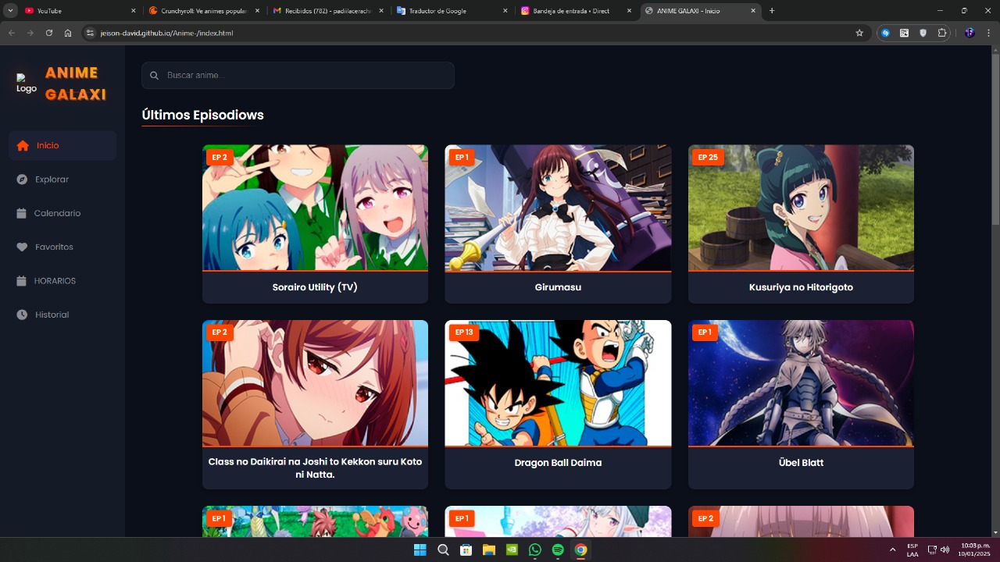

<div align="center">
  
  # ```console.log('¡Hola Mundo! 👋')```
  
  [](Tu-portfolio-link)

  [](https://git.io/typing-svg)
</div>

```javascript
const sobreMi = {
    nombre: "[Jeison david]",
    rol: "Desarrollador Full Stack",
    datos: {
        ubicación: "🌍 [Barranquilla, Colombia]",
        intereses: ["Web3", "IA", "Open Source"],
        café_diario: true,
        modo_actual: "🚀 Building something amazing..."
    }
};
```

<div align="center">
  <h2>🎯 Proyectos Destacados</h2>
</div>

<table>
  <tr>
    <td width="50%">
      <h3 align="center">🌟 [ANIME GALAXI]</h3>
      <div align="center">
        
        <p>
          <a href="https://github.com/JEISON-DAVID/Anime-" target="_blank">
            
          </a>
          <a href="demo-link" target="_blank">
            
          </a>
        </p>
        <p><strong>React - HTML -CSS-JS </strong></p>
        <p>Una aplicación innovadora que revoluciona [sector/área] mediante [tecnologías/características únicas]. Implementa [característica destacada] para [beneficio principal].</p>
      </div>
    </td>
    <td width="50%">
      <h3 align="center">💫 [Segundo Proyecto]</h3>
      <div align="center">
        
        <p>
          <a href="github-repo-link" target="_blank">
            
          </a>
          <a href="demo-link" target="_blank">
            
          </a>
        </p>
        <p><strong>Vue.js - Firebase - TailwindCSS</strong></p>
        <p>Proyecto que [descripción impactante]. Utiliza [tecnología] para [solución única].</p>
      </div>
    </td>
  </tr>
</table>

<div align="center">
  <h2>⚡ Stack Tecnológico</h2>
</div>

<div align="center">
  
  ### Frontend
  
  
  
  
  ### Backend
  
  
  
  
  ### Database & Cloud
  
  
  
</div>

<div align="center">
  <h2>📈 Estadísticas</h2>
</div>

<div align="center">
  
</div>

<details>
  <summary>🌟 Más estadísticas</summary>
  <div align="center">
    
    
  </div>
</details>

<div align="center">
  <h2>🤝 Conectemos</h2>
  
  [](Tu-linkedIn)
  [](Tu-twitter)
  [](https://jeison-david.github.io/Portafolio-/)
  
  
</div>

---

<div align="center">
  
  
</div>
