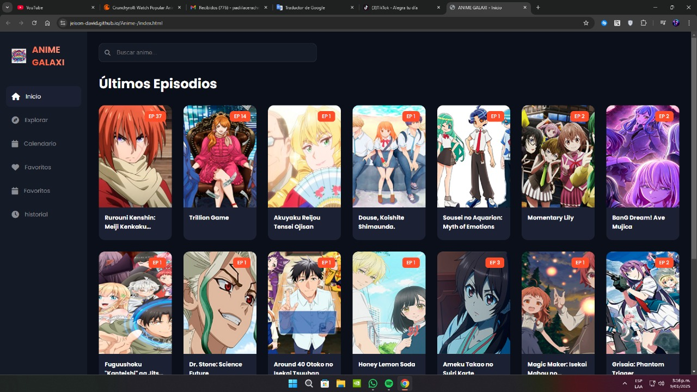

# 👋 ¡Hola Mundo! Soy Jeison David

  

## 🚀 Sobre mí

Soy un desarrollador Full Stack apasionado por crear experiencias digitales únicas. Me especializo en desarrollo web y disfruto transformando ideas creativas en soluciones tecnológicas innovadoras.

## 💻 Tecnologías

### Frontend

### Backend

### Base de Datos

### Herramientas

## 🏆 Proyectos Destacados

### 🌟 ANIME GALAXI

Una plataforma de streaming de anime gratuita que ofrece una experiencia única para los amantes del anime.

- 🔗 [Ver Proyecto](https://jeison-david.github.io/Anime-/)
- 🛠️ **Tecnologías:** 
  
  
  
- ✨ **Características:**
  - Streaming HD
  - Catálogo extenso
  - UI intuitiva
  - Actualizaciones semanales
  - Sin publicidad intrusiva

### 🎮 GameHub Project

Plataforma social para gamers (En desarrollo)
- 🎯 **Objetivo:** Conectar jugadores y compartir experiencias gaming
- 🛠️ **Stack:** React, Firebase, Redux
- 📱 Disponible para Web y Móvil

## 📊 Estadísticas de GitHub

  

  

## 🤝 Conecta Conmigo

  

  

---

  
### 👾 Visitantes

  

  

